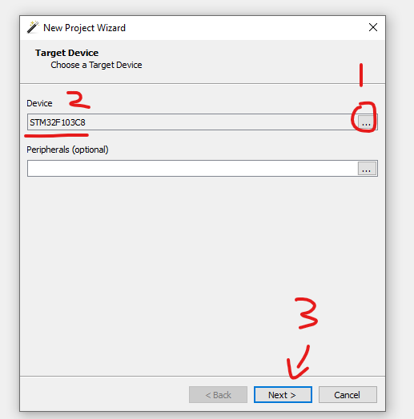
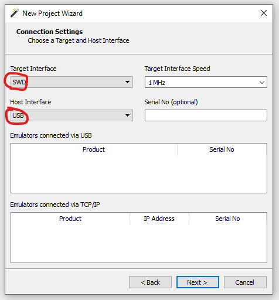
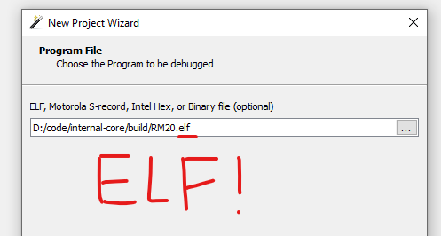
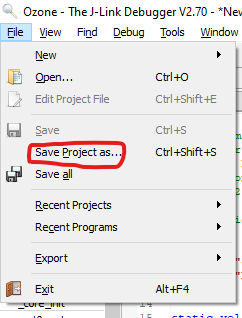
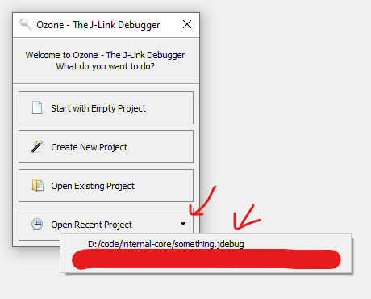

# Assignment for Module 3 and 4

## Description
* In this assignment, you will demonstrate your understanding on embedded programming and FreeRTOS
* You are required to design an API and implement it for the control of a simple motor, MG996R
* To control the motor, you will use pwm to indicate the motor to what angle the motor should turn to a specified angle. 
* Link for specific control protocol of MG996R: https://components101.com/motors/mg996r-servo-motor-datasheet
* Your designed code for the motor should meet the [requirements](#Requirements)


## Instructions
* `git clone` this [repository](https://github.com/wlph17/RM-2020-BluePill) to acquire the generated code. 
* Then cut and paste the whole folder to your own repository(the one you handin your assignments) and work on it.
* `MG996R.cpp` `MG996R.hpp` `UserTask.cpp` is where you will mainly write your code

## Requirements
* Your API should be under a namespace like MG996R and have the function `init()` to initialize the timer you need.
* By doing so, you need to use `MG996R::init()` to call the initializing function.
* This is a good habit and in fact our convention for managing the API of our driver codes.
* Then your API should have a function with prototype `void setTargetAngle(uint8_t angle)` that sets the angle for motor
* Since we are using a specified board, please use (pin name) for the pwm output to control the motor
* Feel free to add any helper functions that you need
```
//header file for your dirver code
namespace MG996R{
    void init();
    void setTargetAngle(uint8_t);
    //other helper functions you need
}
```
* Then, inside the `UserTask.cpp`, where our FreeRTOS tasks are defined and created, write and create a task that can demonstrate your written driver code
* Since you are working on a multi-threading code, your `UserTasks.cpp` should also define a task that makes an LED to blink once every second, or with a frequency that you prefer. This is to make sure that your driver is thread-safe.

## Hints and Supplementary Material for PWM Generation:
* Hardware Timer Configuration: https://www.waveshare.com/wiki/STM32CubeMX_Tutorial_Series:_Basic_Timer
* PWM Generation: https://www.waveshare.com/wiki/STM32CubeMX_Tutorial_Series:_PWM
* Use `#include "tim.h" ` in your header file or cpp file to include the HAL library files to control timer and generate PWM 
* `HAL_StatusTypeDef HAL_TIM_PWM_Start(TIM_HandleTypeDef *htim, uint32_t Channel)` initializes the a specified timer channelf or pwm generation
* `HAL_StatusTypeDef HAL_TIM_PWM_ConfigChannel(TIM_HandleTypeDef *htim, TIM_OC_InitTypeDef *sConfig,uint32_t Channel)` helps you to set the pulse width of your generated pwm signal. `*htim ` is the pointer to the timer handler instance generated by STM32 CUBEMX. `*sConfig` is what defines property of the PWM, check the definition of this struct to see how to use it.

## Environment Setup and Debugger Setup to Compile and Run Your Code
* Please refer to the powerpoint here : (final link for powerpoint instruction)
* __REMEMBER TO READ THE INSTRUCTIONS CAREFULLY AND THOROUGHLY BEFORE YOU START INSTALLING YOUR TOOLCAHIN FOR COMPILATION!__

## Usage of Ozone

### New Project
1. Open Ozone <br>
2. 
3. 
4. 
5. 
6. Click the menu the save the project file for later usage:  
    

### Old Project



## Submission for Students at Hong Kong
* To test whether your code is functional, come to our lab and upload your code to our development board. 
* You can also write your code in the lab and test your half-complete code whenever there is a free development board.
* It is very likely that your code does not work on the first time. That's OK. Though software seniors will not directly debug for you, we will give you useful advices for debugging!
* Full credits will be given for this assignment if you can achieve the [requirements](#requirements) above!

## Submission for Students Not at Hong Kong
* Push your work to your own repository that you used for submission of CPP module
* To see whether your code is functional, contact seniors for a debug and demo session. We will pull your code from your repository and try to run it on our development board. 
* In the demo session, if a bug occurs(which is very likely), we will debug together with you. But if the debugging takes too much time and another junior comes for online debugging, you will have to leave the meeting and book for another session
* Like the offline students at HK, you can have full marks if the [requirements](#requirements) are met. 
* Of course, we will deduct less points if the requirements are not fully met, since we know it is hard to debug online :( 